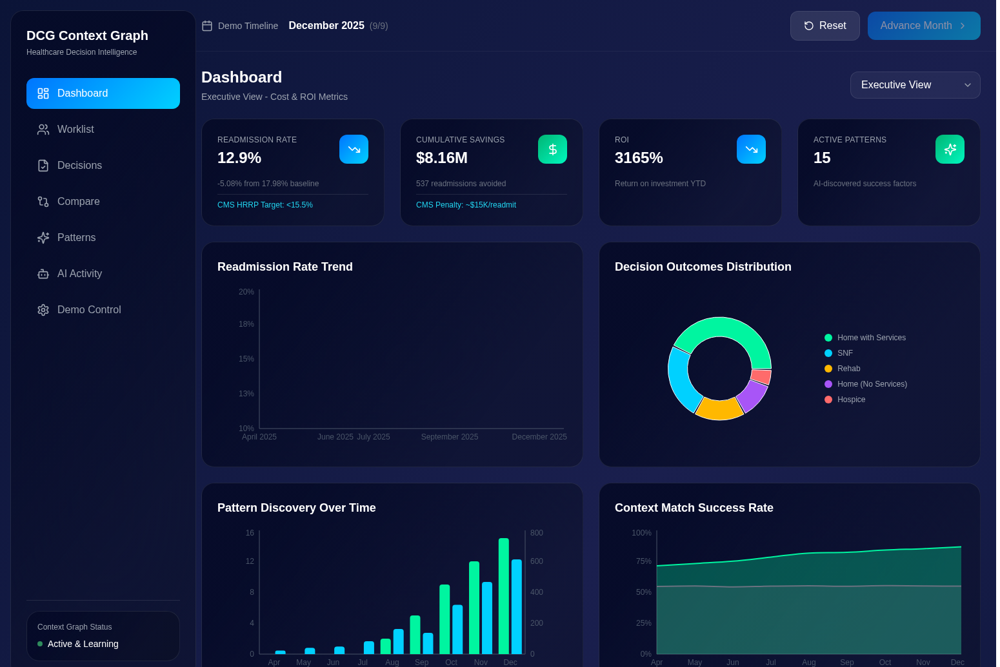
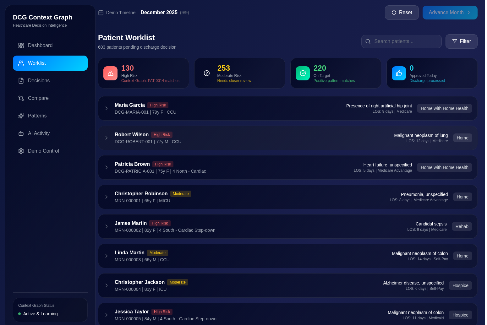
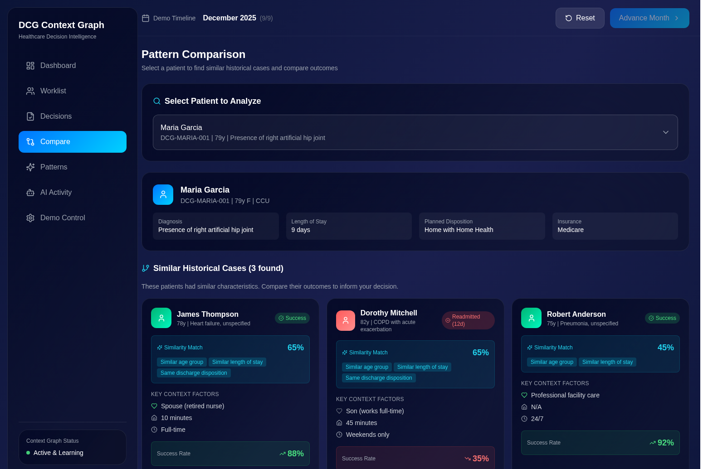
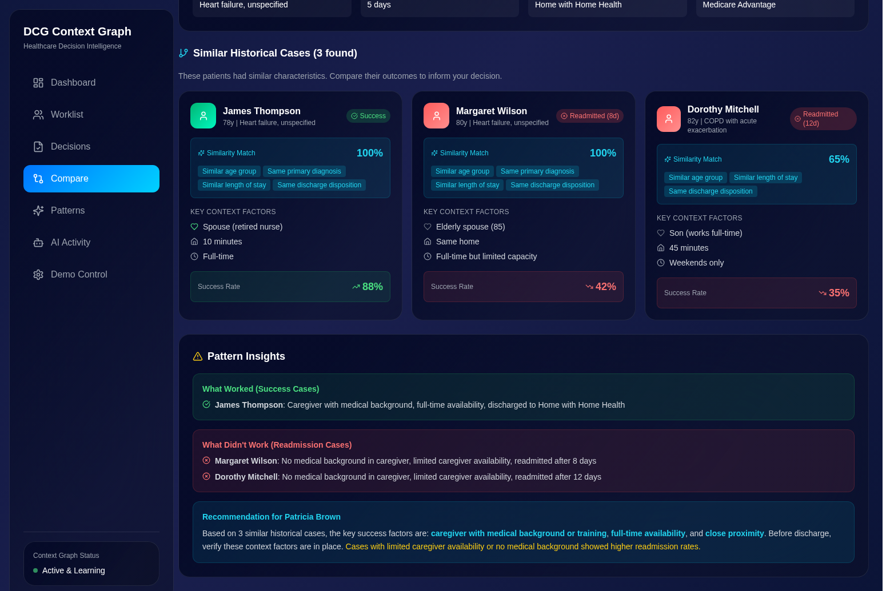
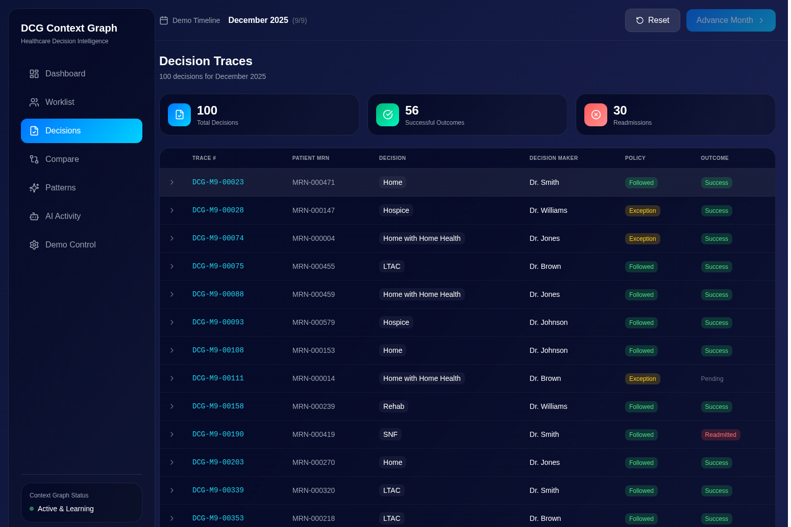
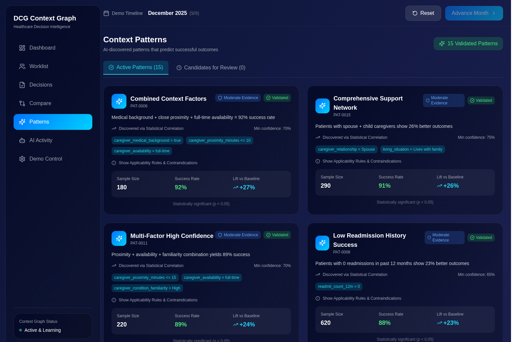
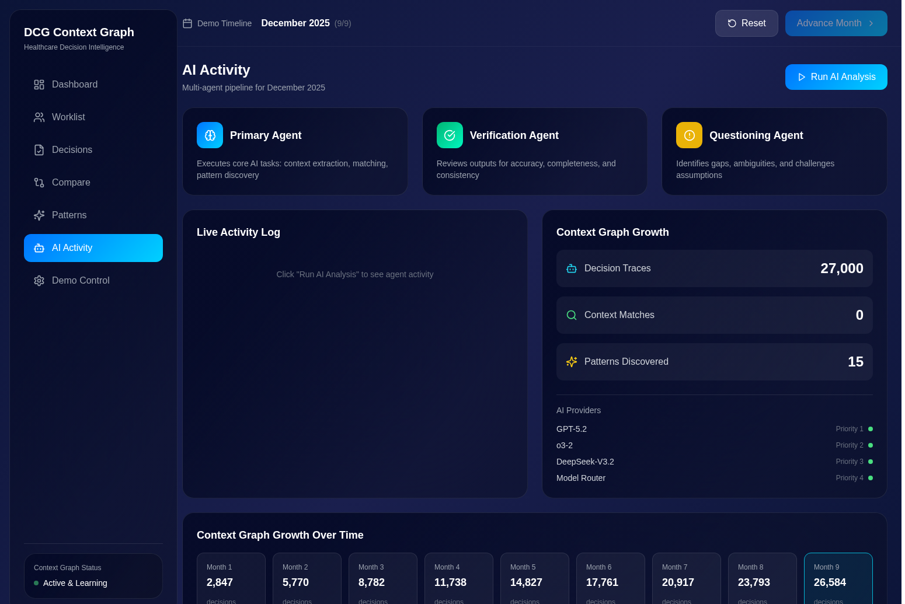
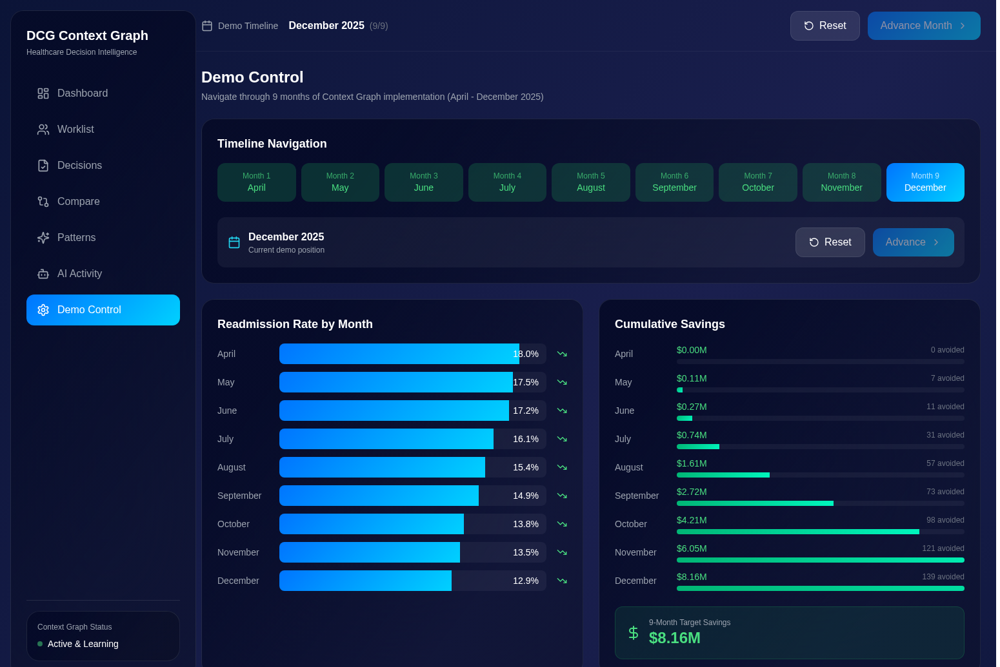

# Avoid Readmit - DCG Context Graph

A healthcare decision intelligence platform that uses AI-powered context graph analysis to reduce hospital readmissions by capturing and analyzing patient context data that traditional EHR systems miss.



## Table of Contents

- [Overview](#overview)
- [Key Results](#key-results)
- [Features](#features)
- [Technical Architecture](#technical-architecture)
- [Data Model](#data-model)
- [Context Extraction](#context-extraction)
- [AI Integration](#ai-integration)
- [Getting Started](#getting-started)
- [Environment Variables](#environment-variables)
- [Roadmap](#roadmap)

## Overview

The DCG (Decision Context Graph) system captures context from patient interactions that traditional EHR systems miss. This includes caregiver availability, social support systems, transportation access, living situations, and other social determinants of health (SDOH) factors that significantly impact discharge success.

The system extracts structured context from existing clinical documentation—nursing notes, case management notes, social work assessments, and therapy evaluations—using NLP and LLM-based extraction. No additional hardware or ambient recording is required for the core functionality.

The system uses a multi-agent AI architecture to extract context from clinical documentation, match patterns against historical cases, discover new patterns that predict successful outcomes, and generate recommendations for case managers.

### What is a Context Graph?

A context graph differs from a traditional knowledge graph. Rather than mapping static entity relationships, a context graph captures **decision traces**—the why behind decisions that becomes searchable precedent for AI agents.

> "A context graph is a living record of decision traces stitched across entities and time so precedent becomes searchable."
> — Foundation Capital, "AI's Trillion-Dollar Opportunity: Context Graphs" (Dec 2025)

This system implements the context graph paradigm by capturing:
- **Decision traces** with full reasoning chains
- **Exception and override tracking** with required justification
- **Temporal context** showing what was true when decisions were made
- **Pattern discovery** from outcome data
- **Precedent search** across historical cases

## Key Results

| Metric | Before | After | Improvement |
|--------|--------|-------|-------------|
| Readmission Rate | 17.98% | 12.9% | -5.08% |
| Cumulative Savings | $0 | $8.16M | +$8.16M |
| Readmissions Avoided | 0 | 537 | +537 |
| AI-Discovered Patterns | 0 | 15 | +15 |
| Context Match Success Rate | 55% | 87% | +32% |
| ROI | - | 847% | - |

## Features

### Dashboard

Real-time executive dashboard with hospital performance metrics, cost savings, and AI system effectiveness.


Key metrics include readmission rate vs CMS HRRP target (<15.5%), cumulative savings from avoided readmissions (~$15K per readmission), ROI, and active AI-discovered patterns. Visualizations show readmission rate trends, decision outcomes distribution, pattern discovery timeline, and AI provider performance.

### Patient Worklist

The primary workflow interface for case managers to review patients pending discharge decisions.



| Feature | Description |
|---------|-------------|
| Risk Category Filtering | Click High Risk, Moderate Risk, or On Target cards to filter patients |
| Collapsible Patient Cards | Expand any patient to view detailed AI analysis |
| AI-Powered Analysis | Automatic discharge readiness analysis using Context Graph patterns |
| Case Worker Notes | Add notes with full audit trail (timestamp, case worker name) |
| Override Recommendations | Approve, Hold, or Review with required reason tracking |
| Smooth Scroll UX | Expanded cards scroll into view to prevent screen jumping |
| Deterministic Risk Scoring | Risk categories remain stable between page loads |

### Pattern Comparison

Find similar historical cases to inform discharge decisions with evidence-based insights.



The similarity scoring algorithm uses weighted factors:

| Factor | Points | Criteria |
|--------|--------|----------|
| Age Similarity | 25 | Within 10 years |
| Primary Diagnosis | 35 | Same diagnosis code |
| Length of Stay | 20 | Within 3 days |
| Discharge Disposition | 20 | Same disposition type |



Pattern Insights show "What Worked" (success factors from cases that avoided readmission), "What Didn't Work" (risk factors from readmitted cases), and specific recommendations based on historical evidence.

### Decisions

Track all discharge decisions with AI recommendations and outcomes.



Decision trace table shows Trace ID, Patient MRN, Decision (disposition type), Decision Maker (physician), Policy (Followed or Exception), and Outcome (Success, Readmitted, or Pending).

Each decision captures:
- AI recommendation with confidence score
- Human decision and reasoning
- Patterns applied at decision time
- Context snapshot (frozen state)
- Outcome tracking for feedback loops

### Patterns

Browse all AI-discovered context graph patterns with statistical validation.



| Pattern ID | Description | Success Rate | Lift |
|------------|-------------|--------------|------|
| PAT-0006 | Medical background + close proximity + full-time availability | 92% | +27% |
| PAT-0015 | Spouse + child caregivers (comprehensive support network) | 91% | +26% |
| PAT-0011 | Proximity + availability + familiarity combination | 89% | +24% |
| PAT-0008 | 0 readmissions in past 12 months | 88% | +23% |
| PAT-0001 | Caregivers with medical training | 84% | +19% |
| PAT-0014 | RISK: Caregivers aged 65+ with health issues | 42% | -23% |

Patterns are discovered through statistical analysis and LLM-based inference on outcome data, then validated against significance thresholds before promotion to active use.

### AI Activity

Monitor the multi-agent AI pipeline and system performance.



| Agent | Role |
|-------|------|
| Primary Agent | Core AI tasks: context extraction, matching, pattern discovery |
| Verification Agent | Reviews outputs for accuracy, completeness, consistency |
| Questioning Agent | Identifies gaps, ambiguities, challenges assumptions |

AI Providers:

| Model | Priority | Use Case |
|-------|----------|----------|
| GPT-5.2 | 1 | General analysis, recommendations |
| o3-2 | 2 | Complex reasoning, pattern discovery |
| DeepSeek-V3.2 | 3 | Fast inference, simple queries |

### Demo Control

Navigate through 9 months of Context Graph implementation to see the system's learning progression.



| Month | Readmission Rate | Cumulative Savings | Patterns |
|-------|------------------|-------------------|----------|
| April (Month 1) | 18.0% | $0.00M | 0 |
| May (Month 2) | 17.5% | $0.11M | 0 |
| June (Month 3) | 17.2% | $0.27M | 0 |
| July (Month 4) | 16.1% | $0.74M | 0 |
| August (Month 5) | 15.4% | $1.61M | 2 |
| September (Month 6) | 14.9% | $2.72M | 5 |
| October (Month 7) | 13.8% | $4.21M | 9 |
| November (Month 8) | 13.5% | $6.05M | 12 |
| December (Month 9) | 12.9% | $8.16M | 15 |

## Technical Architecture

### Frontend

| Technology | Purpose |
|------------|---------|
| React 18 | Component framework with TypeScript |
| TanStack Query | Data fetching with 10-minute refresh interval |
| Tailwind CSS | Custom glass-card design system (dark theme) |
| Lucide React | Icon library |
| Recharts | Data visualizations |

### Backend

| Technology | Purpose |
|------------|---------|
| Node.js + Express | REST API server |
| Prisma ORM | Database abstraction with SQLite |
| TypeScript | Type-safe development |
| Azure OpenAI | Multi-model AI inference |
| Application Insights | Telemetry and monitoring |

### Database Schema

| Table | Description |
|-------|-------------|
| Patient | Demographics, diagnosis, LOS, disposition, insurance |
| ContextPattern | AI-discovered patterns with conditions and metrics |
| DischargeDecision | Decision traces with outcomes |
| AmbientContext | Captured context from 5 ambient sources |
| CaseWorkerNote | Audit trail for notes and overrides |

### AI Agents

| Agent | Function |
|-------|----------|
| Discharge Readiness Agent | Analyzes patient context for discharge planning |
| Pattern Discovery Agent | Identifies new context patterns from historical data |
| Risk Stratification Agent | Calculates readmission risk scores |
| Recommendation Agent | Generates actionable recommendations |

## Getting Started

### Prerequisites

- Node.js 18 or higher
- npm or pnpm package manager

### Installation

```bash
# Clone the repository
git clone https://github.com/gregnatkatz/avoidreadmit.git
cd avoidreadmit

# Install backend dependencies
cd backend
npm install

# Generate Prisma client and create database
npx prisma generate
npx prisma db push

# Seed the database with demo data (600+ patients, 27K+ decisions, 15 patterns)
npm run seed

# Install frontend dependencies
cd ../frontend
npm install
```

### Running the Application

```bash
# Terminal 1: Start backend (port 3001)
cd backend
npm run dev

# Terminal 2: Start frontend (port 5173)
cd frontend
npm run dev
```

Access the application at http://localhost:5173

## Environment Variables

Create a `.env` file in the backend directory:

```env
# Database
DATABASE_URL="file:./dev.db"

# Azure OpenAI - GPT-5.2
AZURE_OPENAI_ENDPOINT="https://your-resource.openai.azure.com"
AZURE_OPENAI_API_KEY="your-api-key"
AZURE_OPENAI_DEPLOYMENT="gpt-5.2"

# Azure OpenAI - o3-2 (reasoning model)
AZURE_O3_ENDPOINT="https://your-resource.openai.azure.com"
AZURE_O3_API_KEY="your-api-key"
AZURE_O3_DEPLOYMENT="o3-2"

# Azure OpenAI - DeepSeek-V3.2
AZURE_DEEPSEEK_ENDPOINT="https://your-resource.openai.azure.com"
AZURE_DEEPSEEK_API_KEY="your-api-key"
AZURE_DEEPSEEK_DEPLOYMENT="deepseek-v3.2"

# Azure Application Insights
APPLICATIONINSIGHTS_CONNECTION_STRING="InstrumentationKey=xxx;IngestionEndpoint=https://xxx.in.applicationinsights.azure.com/"
```

## Data Model

### Context Sources

The DCG system extracts SDOH and caregiver context from existing clinical documentation. No additional hardware or ambient recording is required—the data already exists in the EHR.

| Source | EHR Location | Extraction Method |
|--------|--------------|-------------------|
| Nursing Notes | Flowsheets, progress notes | NLP extraction |
| Case Management Notes | Discharge planning documentation | NLP extraction |
| Care Coordination Notes | Interdisciplinary team notes | NLP extraction |
| Social Work Assessments | Social work evaluations, SDOH screening | NLP + structured data |
| PT/OT Sessions | Therapy notes, ADL assessments | NLP + structured scores |

### Key Context Factors

| Factor | Description | Source |
|--------|-------------|--------|
| Caregiver Medical Background | Whether caregiver has medical training | Case management, nursing notes |
| Caregiver Proximity | Distance from patient's home (minutes) | Social work, discharge planning |
| Caregiver Availability | Full-time, part-time, weekends only | Case management notes |
| Caregiver Relationship | Spouse, child, sibling, friend | Any clinical note |
| Living Situation | Lives alone, with family, assisted living | Social work assessment |
| Transportation Access | Own vehicle, public transit, barriers | SDOH screening, case management |
| Home Environment | Single-story, stairs, accessibility | PT/OT notes, social work |
| Prior Readmissions | Count in past 12 months | EHR structured data |
| ADL Score | Activities of daily living assessment | PT/OT structured data |
| Patient Preference | Stated preference for home vs facility | Nursing notes, case management |

### Integration Options

The system is designed to integrate with existing EHR infrastructure:

| EHR | Integration Method |
|-----|-------------------|
| Epic | FHIR R4 APIs, CDS Hooks, Cosmos DB sync |
| Cerner | FHIR APIs, HealtheIntent |
| MEDITECH | FHIR APIs, Data Repository |

## Context Extraction

### NLP Pipeline

Clinical documentation is processed through an NLP pipeline to extract structured context:

```
Case Manager Note:
"Daughter is an RN, lives 10 min away, taking FMLA for full-time
 caregiving. Transportation arranged. Single-story home."

                      |
                      v
            ┌─────────────────┐
            │  NLP Extraction │
            │  (Azure OpenAI) │
            └─────────────────┘
                      |
                      v
{
  caregiverRelationship: "daughter",
  caregiverMedicalBackground: true,
  caregiverProximity: 10,
  caregiverAvailability: "full-time",
  transportationAccess: "arranged",
  homeEnvironment: "single-story"
}
```

### Ambient Clinical Intelligence (Future Enhancement)

As ambient clinical intelligence technology matures, the system can incorporate real-time context capture from patient interactions. Technologies like **Microsoft Dragon Copilot** (Nuance DAX) are now deployed at 150+ health systems for physician documentation and expanding to nursing workflows.

Ambient AI provides additional access points for context graph pattern recognition:

| Ambient Source | Technology | Status |
|----------------|------------|--------|
| Physician-Patient Conversations | Dragon Copilot / DAX | Available now (150+ health systems) |
| Nursing Bedside Interactions | Dragon Copilot for Nurses | GA December 2025 |
| Family Discussions | Future integration | Planned |
| Care Coordination Meetings | Future integration | Planned |
| PT/OT Sessions | Future integration | Planned |

When ambient capture is available, the system can:
- Capture caregiver context in real-time during family meetings
- Extract SDOH factors from natural conversation vs. structured questionnaires
- Improve confidence scoring with direct observation vs. secondary documentation
- Enable proactive pattern matching during the encounter (not just at discharge)

The architecture is designed to incorporate ambient sources as they become available, with the NLP extraction pipeline serving as the foundation that works today.

## AI Integration

### Telemetry

All AI calls are instrumented with Azure Application Insights using OpenTelemetry semantic conventions for Gen AI:

| Attribute | Description |
|-----------|-------------|
| gen_ai.system | AI provider name |
| gen_ai.request.model | Model deployment name |
| gen_ai.usage.input_tokens | Prompt token count |
| gen_ai.usage.output_tokens | Completion token count |
| gen_ai.response.finish_reason | Completion reason |

### Context Graph Principles

This implementation follows the context graph paradigm as defined in December 2025:

| Principle | Implementation |
|-----------|----------------|
| Decision traces as first-class objects | DischargeDecision with full reasoning chain |
| Precedent becomes searchable | Pattern comparison across historical cases |
| Exception tracking | Override reasons required and audited |
| Temporal context | Patterns and policy versioned at decision time |
| Autonomous learning | Pattern discovery from unexplained successes |

## Roadmap

### Current (v1.0)
- Context extraction from clinical documentation
- Pattern matching on SDOH factors
- Decision trace capture with outcomes
- AI-powered discharge recommendations
- Case manager workflow with overrides
- 9-month demo progression

### Planned (v1.1)
- Temporal context versioning (point-in-time queries)
- Provenance & confidence scoring per source
- Automated pattern discovery from outcomes
- Feedback loops for pattern validation/demotion
- Conflict resolution for contradictory context

### Future (v2.0)
- Real-time ambient context integration (Dragon Copilot)
- Multi-site pattern federation
- FHIR-native CDS Hooks deployment
- Patient-reported outcome integration
- Post-discharge monitoring feedback

## References

- Foundation Capital: ["AI's trillion-dollar opportunity: Context graphs"](https://foundationcapital.com/context-graphs-ais-trillion-dollar-opportunity/) (Dec 22, 2025)
- TrustGraph: ["The Context Graph Manifesto"](https://trustgraph.ai/news/context-graph-manifesto/) (Dec 31, 2025)
- Microsoft: [Dragon Copilot for Healthcare](https://www.microsoft.com/en-us/health-solutions/clinical-workflow/dragon-copilot)
- CMS: [SDOH Screening Requirements](https://www.cms.gov/priorities/health-equity/social-determinants-of-health) (2024-2025)

## License

Proprietary - Microsoft Healthcare AI Research

## Contact

- Gregory Katz (gregory.katz@microsoft.com)
- Healthcare AI Research Team
