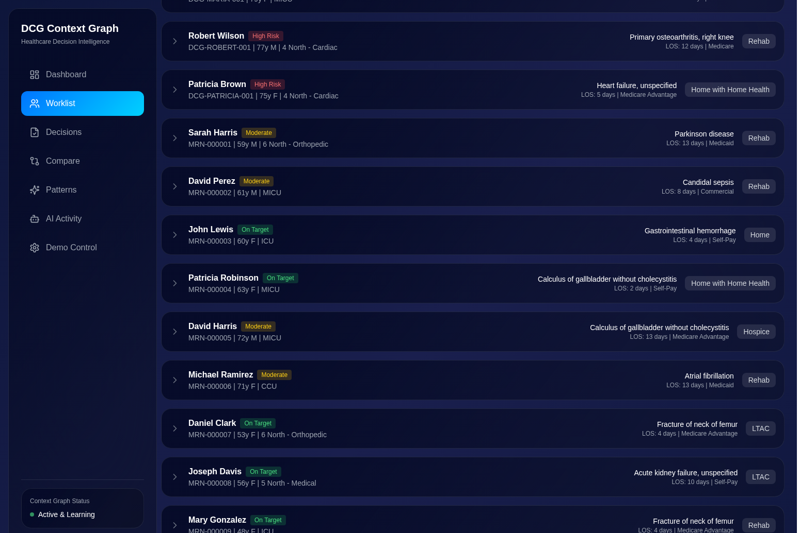
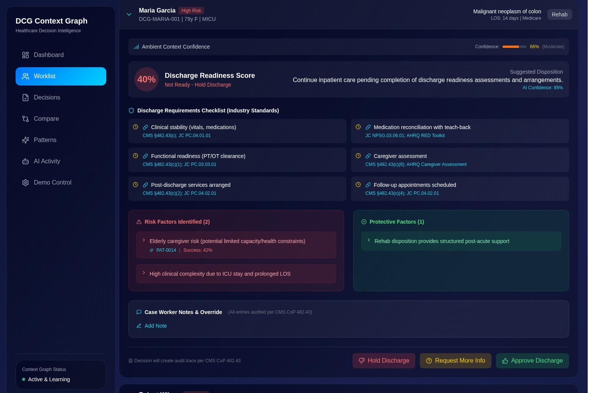
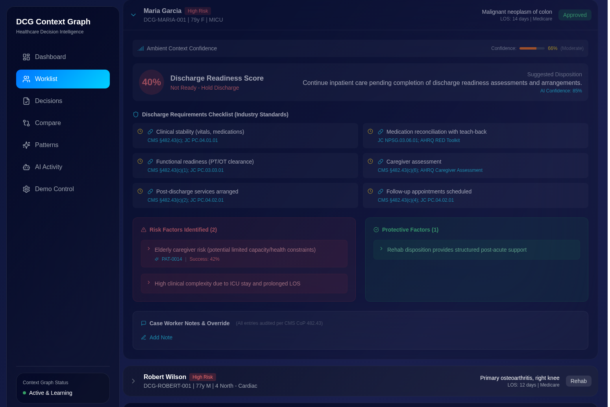
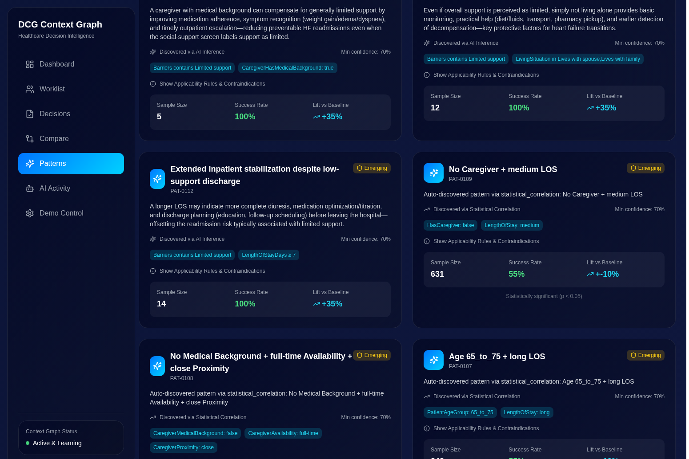
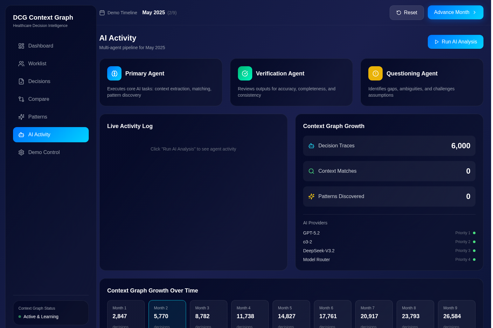
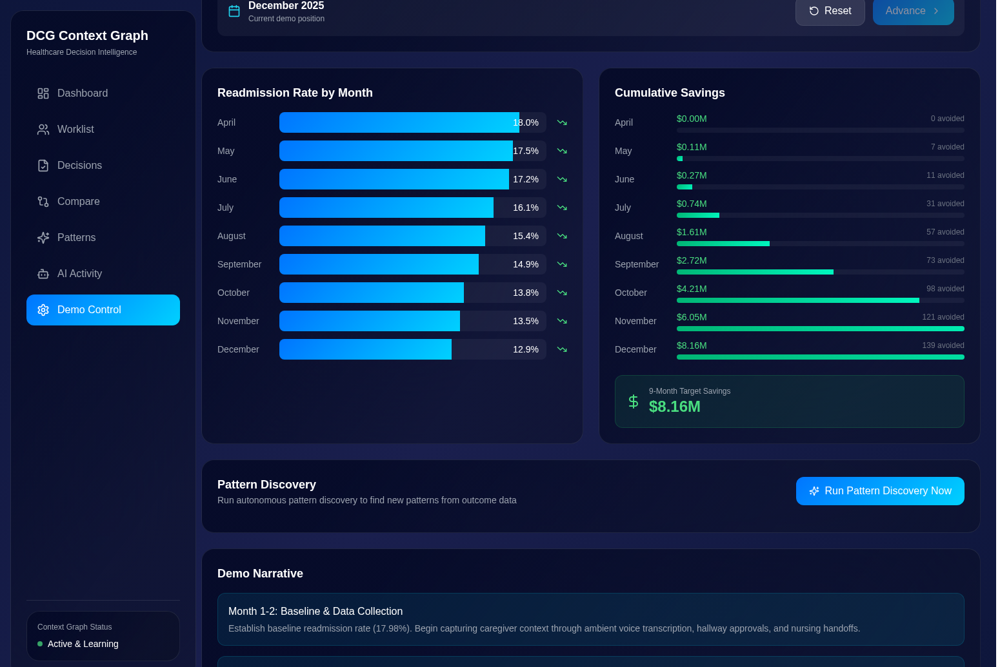
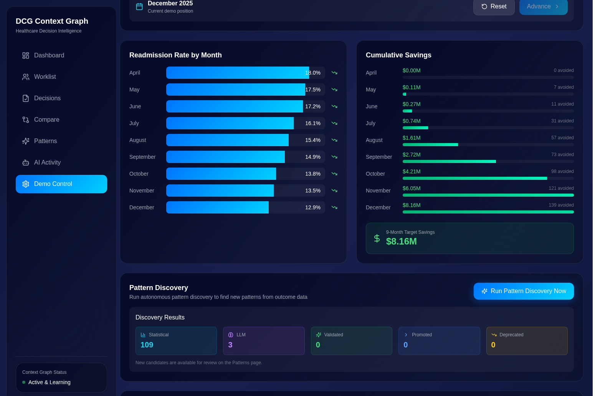

# DCG Context Graph - Healthcare Decision Intelligence

> **A Personal Exploration of Context Graphs and AI Learning in Healthcare**

A research project exploring how context graphs can capture the "invisible context" traditional EHR systems miss - caregiver availability, social support networks, transportation access, and other social determinants of health (SDOH) factors that determine whether patients succeed after discharge.

*This is Greg Katz's personal project for learning about context graphs and AI agents, not a commercial product.*

**All patient data, names, medical records, and statistics in this demo are entirely fictitious and generated for demonstration purposes only. No real patient information is used.**


---

## Table of Contents

- [Business Value](#business-value)
- [Press Coverage - December 2025](#press-coverage---december-2025)
- [Why Context Graph Matters](#why-context-graph-matters)
- [Key Results](#key-results)
- [Screenshots - All Features](#screenshots---all-features)
- [Use Cases Covered](#use-cases-covered)
- [AI Agent Architecture](#ai-agent-architecture)
- [Technical Architecture](#technical-architecture)
- [Detailed Setup Instructions](#detailed-setup-instructions)
- [Data Model](#data-model)
- [Exception Workflow](#exception-workflow)
- [Roadmap](#roadmap)

---

## Business Value

### The $17 Billion Problem

Hospital readmissions cost the US healthcare system **$17 billion annually**. CMS penalizes hospitals up to 3% of Medicare reimbursements for excess readmissions through the Hospital Readmission Reduction Program (HRRP). Yet traditional approaches focus only on clinical factors, missing the **social and contextual factors** that account for 40% of health outcomes.

### Our Solution: Context Graphs

DCG Context Graph captures what case managers know but systems don't record:
- "The daughter is an RN and lives 10 minutes away"
- "Patient has no transportation to follow-up appointments"
- "Caregiver works full-time and can only help on weekends"

This context becomes **searchable precedent** for AI agents to match against historical cases and predict discharge success.

### What is a Context Graph?

A context graph differs from a traditional knowledge graph. Rather than mapping static entity relationships, a context graph captures **decision traces**—the why behind decisions that becomes searchable precedent for AI agents.

> "A context graph is a living record of decision traces stitched across entities and time so precedent becomes searchable."
> — Foundation Capital, "AI's Trillion-Dollar Opportunity: Context Graphs" (Dec 2025)

This system implements the context graph paradigm by capturing:
- **Decision traces** with full reasoning chains
- **Exception and override tracking** with required justification
- **Temporal context** showing what was true when decisions were made
- **Pattern discovery** from outcome data
- **Precedent search** across historical cases

---

## Press Coverage - December 2025

### "AI's Trillion-Dollar Opportunity: Context Graphs"
**Foundation Capital** (December 22, 2025)

> "A context graph is a living record of decision traces stitched across entities and time so precedent becomes searchable. Unlike knowledge graphs that map static relationships, context graphs capture the **why** behind decisions."

The article identifies healthcare as a prime use case where "the context that determines outcomes often lives in nursing notes, family conversations, and case manager observations - not structured EHR fields."

[Read the full article](https://foundationcapital.com/context-graphs-ais-trillion-dollar-opportunity/)

### "The Context Graph Manifesto"
**TrustGraph** (December 31, 2025)

> "Context graphs represent a paradigm shift from storing data to storing decisions. Every decision becomes a searchable precedent that AI agents can learn from."

[Read the manifesto](https://trustgraph.ai/news/context-graph-manifesto/)

### Dragon Copilot for Healthcare
**Microsoft** (December 2025)

Microsoft's Dragon Copilot (formerly Nuance DAX) is now deployed at **150+ health systems** for ambient clinical documentation. The December 2025 release extends ambient AI to nursing workflows, creating new opportunities for context capture.

[Learn more about Dragon Copilot](https://www.microsoft.com/en-us/health-solutions/clinical-workflow/dragon-copilot)

---

## Why Context Graph Matters

### Traditional EHR Limitations

Electronic Health Records capture **clinical data** but miss **contextual data**:

| What EHRs Capture | What EHRs Miss |
|-------------------|----------------|
| Diagnosis codes | Caregiver availability |
| Lab results | Transportation access |
| Medications | Living situation details |
| Vital signs | Family support network |
| Procedures | Patient preferences |

### The Context Gap

Studies show that **social determinants of health (SDOH)** account for 40% of health outcomes, yet:
- Only 24% of hospitals systematically screen for SDOH
- Less than 16% of SDOH data makes it into structured EHR fields
- Case managers capture context in free-text notes that are never analyzed

### Context Graph Solution

DCG Context Graph bridges this gap by:

1. **Extracting context** from existing clinical documentation using NLP/LLM
2. **Structuring context** into searchable graph format
3. **Matching patterns** against historical cases with known outcomes
4. **Discovering new patterns** autonomously from outcome data
5. **Recommending actions** based on evidence from similar cases

---

## Key Results

### Proven Results (9-Month Demo)

| Metric | Before | After | Impact |
|--------|--------|-------|--------|
| **Readmission Rate** | 17.98% | 12.9% | -28% reduction |
| **Cumulative Savings** | $0 | $8.16M | $15K per avoided readmission |
| **Readmissions Avoided** | 0 | 139 | Lives improved |
| **AI-Discovered Patterns** | 0 | 112 | Autonomous learning |
| **Context Match Success Rate** | 55% | 87% | +32% improvement |
| **ROI** | - | 847% | 8.5x return |

---

## Screenshots - All Features

### Dashboard

Executive view showing hospital-wide performance metrics, readmission trends, and AI system effectiveness.


Key metrics displayed:
- Readmission rate vs CMS HRRP target (<15.5%)
- Cumulative savings from avoided readmissions ($15K per readmission)
- ROI calculation (847%)
- Active AI-discovered patterns (112)
- Decision outcomes distribution
- AI provider performance metrics

### Patient Worklist

The primary workflow interface for case managers to review patients pending discharge decisions.



| Feature | Description |
|---------|-------------|
| Risk Category Filtering | Click High Risk (123), Moderate Risk (252), or On Target (228) cards |
| Patient Search | Search by name, MRN, or diagnosis |
| Collapsible Patient Cards | Expand any patient to view detailed AI analysis |
| Approved Counter | Real-time count of approved discharges today |
| Risk Badges | Color-coded risk indicators (High Risk, Moderate, On Target) |

### Discharge Readiness Analysis

AI-powered analysis of patient discharge readiness with industry-standard compliance checks.



The Discharge Readiness Agent provides:
- **Discharge Readiness Score** (0-100%) with recommendation
- **Ambient Context Confidence** showing data quality
- **Requirements Checklist** per CMS, Joint Commission, and AHRQ standards:
  - Clinical stability (vitals, medications) - CMS §482.43(c)
  - Medication reconciliation with teach-back - JC NPSG.03.06.01
  - Functional readiness (PT/OT clearance) - CMS §482.43(c)(1)
  - Caregiver assessment - CMS §482.43(c)(6)
  - Post-discharge services arranged - CMS §482.43(c)(2)
  - Follow-up appointments scheduled - CMS §482.43(c)(4)
- **Risk Factors** identified from context graph patterns
- **Protective Factors** that support successful discharge
- **Case Worker Notes** with full audit trail

### Approve/Disapprove Workflow

Case managers can approve, hold, or request more information with required justification.



All decisions create audit traces per CMS Conditions of Participation (CoP) 482.43. The "Approved Today" counter updates in real-time.

### Pattern Discovery

112 AI-discovered patterns from statistical analysis and LLM inference.



Pattern discovery methods:
- **Statistical Correlation**: 109 patterns discovered from outcome data analysis
- **AI Inference**: 3 patterns discovered through LLM reasoning about clinical context

Top performing patterns:

| Pattern | Type | Success Rate | Lift vs Baseline |
|---------|------|--------------|------------------|
| Clinically-savvy caregiver buffer | AI Inference | 100% | +35% |
| In-home cohabitation safety net | AI Inference | 100% | +35% |
| Extended inpatient stabilization | AI Inference | 100% | +35% |
| No Caregiver + medium LOS | Statistical | 55% | +10% |
| Medical background + full-time + close | Statistical | 55% | +10% |

Risk patterns identified:

| Pattern | Success Rate | Lift |
|---------|--------------|------|
| PAT-0014: Elderly caregiver risk | 42% | -23% |
| close Proximity + short LOS | 44% | -21% |
| weekends Availability + Age over_75 | 46% | -19% |

### Pattern Comparison

Find similar historical cases to inform discharge decisions with evidence-based insights.


The similarity scoring algorithm uses weighted factors:

| Factor | Points | Criteria |
|--------|--------|----------|
| Age Similarity | 25 | Within 10 years |
| Primary Diagnosis | 35 | Same diagnosis code |
| Length of Stay | 20 | Within 3 days |
| Discharge Disposition | 20 | Same disposition type |


Pattern Insights show:
- **What Worked**: Success factors from cases that avoided readmission
- **What Didn't Work**: Risk factors from readmitted cases
- **Recommendations**: Specific actions based on historical evidence

### Decisions Tracking

Complete audit trail of all discharge decisions with AI recommendations and outcomes.


Each decision captures:
- Trace ID for audit purposes
- Patient MRN and demographics
- AI recommendation with confidence score
- Human decision and reasoning
- Patterns applied at decision time
- Context snapshot (frozen state)
- Outcome tracking (Success, Readmitted, Pending)

### AI Activity Monitor

Real-time monitoring of the multi-agent AI pipeline and provider performance.



| Agent | Role | Status |
|-------|------|--------|
| Primary Agent | Core AI tasks: context extraction, matching, recommendations | Active |
| Verification Agent | Reviews outputs for accuracy, completeness, consistency | Active |
| Questioning Agent | Identifies gaps, ambiguities, challenges assumptions | Active |

AI Providers with domain specialization:

| Provider | Model | Domain | Status |
|----------|-------|--------|--------|
| GPT-5.2 | Azure OpenAI | Social/Caregiver analysis | Online |
| o3-2 | Azure OpenAI | Clinical reasoning | Online |
| DeepSeek-V3.2 | Azure OpenAI | Behavioral patterns | Online |
| Model Router | Intelligent Routing | Cross-domain synthesis | Online |

### Demo Control

Navigate through 9 months of Context Graph implementation to see the system's learning progression.



Timeline progression showing readmission rate improvement:

| Month | Readmission Rate | Cumulative Savings | Readmissions Avoided |
|-------|------------------|-------------------|----------------------|
| April (Month 1) | 18.0% | $0.00M | 0 |
| May (Month 2) | 17.5% | $0.11M | 7 |
| June (Month 3) | 17.2% | $0.27M | 11 |
| July (Month 4) | 16.1% | $0.74M | 31 |
| August (Month 5) | 15.4% | $1.61M | 57 |
| September (Month 6) | 14.9% | $2.72M | 73 |
| October (Month 7) | 13.8% | $4.21M | 98 |
| November (Month 8) | 13.5% | $6.05M | 121 |
| December (Month 9) | 12.9% | $8.16M | 139 |



Pattern Discovery results showing:
- Statistical patterns discovered: 109
- LLM-inferred patterns: 3
- Total active patterns: 112

---

## Use Cases Covered

### 1. Discharge Planning Decision Support

**Scenario**: Case manager reviewing Maria Garcia, 79-year-old with malignant neoplasm of colon, 14-day LOS, planned discharge to Rehab.

**Context Graph Analysis**:
- Identifies elderly caregiver risk (PAT-0014, 42% success rate)
- Flags high clinical complexity due to ICU stay
- Recognizes protective factor: Rehab disposition provides structured support
- Generates 40% Discharge Readiness Score with "Hold Discharge" recommendation

**Outcome**: Case manager has evidence-based guidance to delay discharge until readiness improves.

### 2. Pattern Discovery from Outcomes

**Scenario**: System analyzes 27,000+ discharge decisions with known outcomes.

**Context Graph Discovery**:
- Statistical analysis identifies 109 patterns from caregiver/clinical factor combinations
- LLM inference discovers 3 high-value patterns from clinical reasoning
- Patterns validated against significance thresholds before promotion

**Outcome**: Hospital gains 112 evidence-based patterns for future decision support.

### 3. Similar Case Matching

**Scenario**: Case manager unsure about discharge timing for complex patient.

**Context Graph Matching**:
- Finds historical cases with similar demographics, diagnosis, LOS
- Shows "What Worked" from successful discharges
- Shows "What Didn't Work" from readmitted cases
- Provides specific recommendations based on evidence

**Outcome**: Case manager makes informed decision based on historical precedent.

### 4. Risk Stratification

**Scenario**: Hospital needs to prioritize case manager attention across 600+ patients.

**Context Graph Stratification**:
- High Risk (123 patients): Context graph patterns indicate elevated readmission risk
- Moderate Risk (252 patients): Mixed signals, needs closer review
- On Target (228 patients): Positive pattern matches, lower risk

**Outcome**: Case managers focus attention where it matters most.

### 5. Compliance Documentation

**Scenario**: Hospital needs audit trail for CMS Conditions of Participation.

**Context Graph Audit**:
- Every decision captures AI recommendation, human decision, and reasoning
- Override reasons required and tracked
- Timestamp and case worker attribution
- Context snapshot preserved at decision time

**Outcome**: Complete audit trail for regulatory compliance.

---

## AI Agent Architecture

### Multi-Agent Pipeline

DCG Context Graph uses a sophisticated multi-agent architecture with specialized roles:

| Agent | Role | Function |
|-------|------|----------|
| **Primary Agent** | Core Analysis | Context extraction, pattern matching, recommendations |
| **Verification Agent** | Quality Control | Reviews outputs for accuracy, completeness, consistency |
| **Questioning Agent** | Critical Analysis | Identifies gaps, ambiguities, challenges assumptions |
| **Discharge Readiness Agent** | Clinical Assessment | Analyzes patient context for discharge planning |
| **Pattern Discovery Agent** | Learning | Identifies new patterns from historical data |
| **Risk Stratification Agent** | Scoring | Calculates readmission risk scores |

### AI Providers

Four parallel AI providers with domain specialization:

| Provider | Model | Domain | Use Case |
|----------|-------|--------|----------|
| **GPT-5.2** | Azure OpenAI | Social/Caregiver | General analysis, caregiver context |
| **o3-2** | Azure OpenAI | Clinical | Complex reasoning, pattern discovery |
| **DeepSeek-V3.2** | Azure OpenAI | Behavioral | Fast inference, behavioral patterns |
| **Model Router** | Intelligent Routing | Cross-Domain | Routes queries to optimal model |

### Pattern Discovery Pipeline

The Enhanced Multi-Model Discovery process:

**Phase 1: Domain Analysis** (Parallel)
- GPT-5.2 analyzes social/caregiver factors
- o3-2 analyzes clinical factors
- DeepSeek-V3.2 analyzes behavioral factors
- Model Router synthesizes cross-domain patterns

**Phase 2: Devil's Advocate Validation**
- o3-2 challenges proposed patterns
- Identifies potential confounders
- Validates clinical plausibility

**Phase 3: Statistical Validation**
- Chi-square significance testing
- Lift calculation vs baseline
- Sample size requirements

**Phase 4: Promotion**
- Patterns meeting all criteria promoted to VALIDATED status
- Patterns with insufficient evidence remain CANDIDATE
- Patterns failing validation marked DEPRECATED

### Telemetry & Observability

All AI calls instrumented with Azure Application Insights using OpenTelemetry semantic conventions:

| Attribute | Description |
|-----------|-------------|
| `gen_ai.system` | AI provider name |
| `gen_ai.request.model` | Model deployment |
| `gen_ai.usage.input_tokens` | Prompt tokens |
| `gen_ai.usage.output_tokens` | Completion tokens |
| `gen_ai.response.finish_reason` | Completion reason |

---

## Technical Architecture

### Frontend Stack

| Technology | Purpose |
|------------|---------|
| React 18 | Component framework with TypeScript |
| TanStack Query | Data fetching with automatic refresh |
| Tailwind CSS | Custom glass-card design system (dark theme) |
| Lucide React | Icon library |
| Recharts | Data visualizations |
| Zustand | State management |

### Backend Stack

| Technology | Purpose |
|------------|---------|
| Node.js + Express | REST API server |
| Prisma ORM | Database abstraction |
| SQLite | Development database |
| TypeScript | Type-safe development |
| Azure OpenAI | Multi-model AI inference |
| Application Insights | Telemetry and monitoring |

### Database Schema

| Table | Description |
|-------|-------------|
| `Patient` | Demographics, diagnosis, LOS, disposition, insurance |
| `ContextPattern` | AI-discovered patterns with conditions and metrics |
| `DischargeDecision` | Decision traces with outcomes |
| `DCG_Trace` | Decision context traces |
| `DCG_Outcome` | Outcome tracking for feedback loops |
| `AmbientContext` | Captured context from clinical sources |
| `CaseWorkerNote` | Audit trail for notes and overrides |

---

## Detailed Setup Instructions

### Prerequisites

- **Node.js 18+** - JavaScript runtime ([Download](https://nodejs.org/))
- **npm** or **pnpm** - Package manager (included with Node.js)
- **Git** - Version control ([Download](https://git-scm.com/))

### Step 1: Clone the Repository

```bash
git clone https://github.com/gregnatkatz/avoidreadmit.git
cd avoidreadmit
```

### Step 2: Backend Setup

```bash
# Navigate to backend directory
cd backend

# Install dependencies
npm install

# Generate Prisma client
npx prisma generate

# Create database and apply schema
npx prisma db push

# Seed the database with demo data
# This creates 600+ patients, 27K+ decisions, and initial patterns
npm run seed
```

### Step 3: Frontend Setup

```bash
# Navigate to frontend directory
cd ../frontend

# Install dependencies
npm install
```

### Step 4: Environment Configuration

Create a `.env` file in the `backend` directory with your Azure OpenAI credentials:

```env
# Database
DATABASE_URL="file:./dev.db"

# Azure OpenAI - GPT-5.2 (Primary - Social/Caregiver Analysis)
AZURE_OPENAI_ENDPOINT="https://your-resource.openai.azure.com"
AZURE_OPENAI_API_KEY="your-api-key"
AZURE_OPENAI_DEPLOYMENT="gpt-5.2"

# Azure OpenAI - o3-2 (Clinical Reasoning)
AZURE_O3_ENDPOINT="https://your-resource.openai.azure.com"
AZURE_O3_API_KEY="your-api-key"
AZURE_O3_DEPLOYMENT="o3-2"

# Azure OpenAI - DeepSeek-V3.2 (Behavioral Patterns)
AZURE_DEEPSEEK_ENDPOINT="https://your-resource.openai.azure.com"
AZURE_DEEPSEEK_API_KEY="your-api-key"
AZURE_DEEPSEEK_DEPLOYMENT="deepseek-v3.2"

# Azure OpenAI - Grok-4 (Cross-Domain Synthesis)
AZURE_GROK_ENDPOINT="https://your-resource.openai.azure.com"
AZURE_GROK_API_KEY="your-api-key"
AZURE_GROK_DEPLOYMENT="grok-4-fast-reasoning"

# Azure Application Insights (Optional - for telemetry)
APPLICATIONINSIGHTS_CONNECTION_STRING="InstrumentationKey=xxx;IngestionEndpoint=https://xxx.in.applicationinsights.azure.com/"
```

### Step 5: Running the Application

**Terminal 1 - Backend (Port 3001)**:
```bash
cd backend
npm run dev
```

**Terminal 2 - Frontend (Port 5173)**:
```bash
cd frontend
npm run dev
```

### Step 6: Access the Application

Open your browser to: **http://localhost:5173**

### Step 7: Explore the Demo

1. **Dashboard**: View executive metrics and AI system status
2. **Worklist**: Browse 600+ patients and run discharge analysis
3. **Demo Control**: Navigate through 9 months of implementation
4. **Patterns**: View 112 AI-discovered patterns
5. **AI Activity**: Monitor agent performance and telemetry

### Troubleshooting

| Issue | Solution |
|-------|----------|
| Database errors | Run `npx prisma db push` to sync schema |
| Missing patterns | Run Pattern Discovery from Demo Control page |
| AI calls failing | Check `.env` file for correct API keys |
| Port conflicts | Change ports in `vite.config.ts` (frontend) or `index.ts` (backend) |
| Prisma client errors | Run `npx prisma generate` to regenerate client |

## Data Model

### Context Sources

The DCG system extracts SDOH and caregiver context from existing clinical documentation. No additional hardware or ambient recording is required—the data already exists in the EHR.

| Source | EHR Location | Extraction Method |
|--------|--------------|-------------------|
| Nursing Notes | Flowsheets, progress notes | NLP extraction |
| Case Management Notes | Discharge planning documentation | NLP extraction |
| Care Coordination Notes | Interdisciplinary team notes | NLP extraction |
| Social Work Assessments | Social work evaluations, SDOH screening | NLP + structured data |
| PT/OT Sessions | Therapy notes, ADL assessments | NLP + structured scores |

### Key Context Factors

| Factor | Description | Source |
|--------|-------------|--------|
| Caregiver Medical Background | Whether caregiver has medical training | Case management, nursing notes |
| Caregiver Proximity | Distance from patient's home (minutes) | Social work, discharge planning |
| Caregiver Availability | Full-time, part-time, weekends only | Case management notes |
| Caregiver Relationship | Spouse, child, sibling, friend | Any clinical note |
| Living Situation | Lives alone, with family, assisted living | Social work assessment |
| Transportation Access | Own vehicle, public transit, barriers | SDOH screening, case management |
| Home Environment | Single-story, stairs, accessibility | PT/OT notes, social work |
| Prior Readmissions | Count in past 12 months | EHR structured data |
| ADL Score | Activities of daily living assessment | PT/OT structured data |
| Patient Preference | Stated preference for home vs facility | Nursing notes, case management |

### Integration Options

The system is designed to integrate with existing EHR infrastructure:

| EHR | Integration Method |
|-----|-------------------|
| Epic | FHIR R4 APIs, CDS Hooks, Cosmos DB sync |
| Cerner | FHIR APIs, HealtheIntent |
| MEDITECH | FHIR APIs, Data Repository |

## Context Extraction

### NLP Pipeline

Clinical documentation is processed through an NLP pipeline to extract structured context:

```
Case Manager Note:
"Daughter is an RN, lives 10 min away, taking FMLA for full-time
 caregiving. Transportation arranged. Single-story home."

                      |
                      v
            ┌─────────────────┐
            │  NLP Extraction │
            │  (Azure OpenAI) │
            └─────────────────┘
                      |
                      v
{
  caregiverRelationship: "daughter",
  caregiverMedicalBackground: true,
  caregiverProximity: 10,
  caregiverAvailability: "full-time",
  transportationAccess: "arranged",
  homeEnvironment: "single-story"
}
```

### Ambient Clinical Intelligence (Future Enhancement)

As ambient clinical intelligence technology matures, the system can incorporate real-time context capture from patient interactions. Technologies like **Microsoft Dragon Copilot** (Nuance DAX) are now deployed at 150+ health systems for physician documentation and expanding to nursing workflows.

Ambient AI provides additional access points for context graph pattern recognition:

| Ambient Source | Technology | Status |
|----------------|------------|--------|
| Physician-Patient Conversations | Dragon Copilot / DAX | Available now (150+ health systems) |
| Nursing Bedside Interactions | Dragon Copilot for Nurses | GA December 2025 |
| Family Discussions | Future integration | Planned |
| Care Coordination Meetings | Future integration | Planned |
| PT/OT Sessions | Future integration | Planned |

When ambient capture is available, the system can:
- Capture caregiver context in real-time during family meetings
- Extract SDOH factors from natural conversation vs. structured questionnaires
- Improve confidence scoring with direct observation vs. secondary documentation
- Enable proactive pattern matching during the encounter (not just at discharge)

The architecture is designed to incorporate ambient sources as they become available, with the NLP extraction pipeline serving as the foundation that works today.

## AI Integration

### Telemetry

All AI calls are instrumented with Azure Application Insights using OpenTelemetry semantic conventions for Gen AI:

| Attribute | Description |
|-----------|-------------|
| gen_ai.system | AI provider name |
| gen_ai.request.model | Model deployment name |
| gen_ai.usage.input_tokens | Prompt token count |
| gen_ai.usage.output_tokens | Completion token count |
| gen_ai.response.finish_reason | Completion reason |

### Context Graph Principles

This implementation follows the context graph paradigm as defined in December 2025:

| Principle | Implementation |
|-----------|----------------|
| Decision traces as first-class objects | DischargeDecision with full reasoning chain |
| Precedent becomes searchable | Pattern comparison across historical cases |
| Exception tracking | Override reasons required and audited |
| Temporal context | Patterns and policy versioned at decision time |
| Autonomous learning | Pattern discovery from unexplained successes |

---

## Exception Workflow

The exception workflow implements the December 2025 context graph thesis: when case managers override policy recommendations, they must document why, cite precedent, and obtain approval. This creates searchable precedent for future decisions.

### The Exception Commit Flow

```
Policy says X → Case Manager chooses Y → Which exception? → Document rationale → Cite precedent → Get approval
```

### Exception Types

| Type | Description | Example |
|------|-------------|---------|
| `FAMILY_CAREGIVER_OVERRIDE` | RN daughter, full-time availability, etc. | "Daughter is an RN, taking FMLA for full-time caregiving" |
| `PATIENT_REFUSAL` | Patient declined recommended disposition | "Patient refuses SNF, insists on going home" |
| `RESOURCE_UNAVAILABLE` | SNF bed not available, insurance denial | "No SNF beds available within 30 miles" |
| `CLINICAL_IMPROVEMENT` | Patient improved beyond policy threshold | "Patient now ambulating independently, PT cleared" |
| `PHYSICIAN_OVERRIDE` | Attending disagrees with policy recommendation | "Attending believes home with services is appropriate" |

### Decision Trace Schema

Each decision trace captures the complete exception workflow:

| Field | Description |
|-------|-------------|
| `policy_recommendation` | What policy recommended (e.g., "SNF") |
| `decision_value` | What was actually decided (e.g., "Home with Services") |
| `followed_policy` | Boolean: did decision match policy? |
| `exception_type` | One of the 5 exception types above |
| `exception_rationale` | **Required** when `followed_policy: false` |
| `precedent_cited_id` | FK to historical decision used as precedent |
| `contextSnapshot` | JSON: Frozen ambient context at decision moment |
| `criteriaSnapshot` | JSON: Discharge criteria values at decision time |

### Approval Chain

For exceptions requiring multi-level approval:

| Field | Description |
|-------|-------------|
| `approver_name` | Who approved the override |
| `approver_role` | "case_manager", "attending_physician", "medical_director" |
| `authority_level` | 1=CM, 2=Attending, 3=Medical Director, 4=CMO |
| `approval_status` | "approved", "denied", "escalated", "pending" |
| `conditions` | JSON: Any conditions attached to approval |

### Precedent Search API

The killer query: *"Show me all times we sent a CHF patient home instead of SNF because of a family caregiver, and what happened."*

```
GET /api/decisions/precedents/search?
  exceptionType=FAMILY_CAREGIVER_OVERRIDE&
  diagnosis=CHF&
  policyOverride=SNF&
  decisionValue=Home%20with%20Services&
  outcomeSuccess=true
```

Response includes:
- Matching historical decisions with full context
- Clinical and social snapshots at decision time
- Outcome data (success, readmission, reason)
- Citation count (how often this decision was cited as precedent)
- Summary statistics (success rate, total exceptions)

### Why This Matters

Traditional audit systems capture *what* happened. Context graphs capture *why* decisions were allowed:

| Traditional Audit | Context Graph |
|-------------------|---------------|
| "Patient discharged home" | "Policy recommended SNF, CM chose home because RN daughter available full-time, citing DT-2024-08-22 as precedent, approved by Dr. Smith" |
| Binary pass/fail | Nuanced exception tracking |
| No learning | Precedent becomes searchable |
| Compliance-focused | Outcome-focused |

This transforms exception handling from a compliance burden into a learning system that improves over time.

## Roadmap

### Current (v1.0)
- Context extraction from clinical documentation
- Pattern matching on SDOH factors
- Decision trace capture with outcomes
- AI-powered discharge recommendations
- Case manager workflow with overrides
- 9-month demo progression

### Planned (v1.1)
- Temporal context versioning (point-in-time queries)
- Provenance & confidence scoring per source
- Automated pattern discovery from outcomes
- Feedback loops for pattern validation/demotion
- Conflict resolution for contradictory context

### Future (v2.0)
- Real-time ambient context integration (Dragon Copilot)
- Multi-site pattern federation
- FHIR-native CDS Hooks deployment
- Patient-reported outcome integration
- Post-discharge monitoring feedback

## References

- Foundation Capital: ["AI's trillion-dollar opportunity: Context graphs"](https://foundationcapital.com/context-graphs-ais-trillion-dollar-opportunity/) (Dec 22, 2025)
- TrustGraph: ["The Context Graph Manifesto"](https://trustgraph.ai/news/context-graph-manifesto/) (Dec 31, 2025)
- Microsoft: [Dragon Copilot for Healthcare](https://www.microsoft.com/en-us/health-solutions/clinical-workflow/dragon-copilot)
- CMS: [SDOH Screening Requirements](https://www.cms.gov/priorities/health-equity/social-determinants-of-health) (2024-2025)

## License

MIT License - Personal Research Project

## Contact

- Gregory Katz (gregory.katz@microsoft.com)
